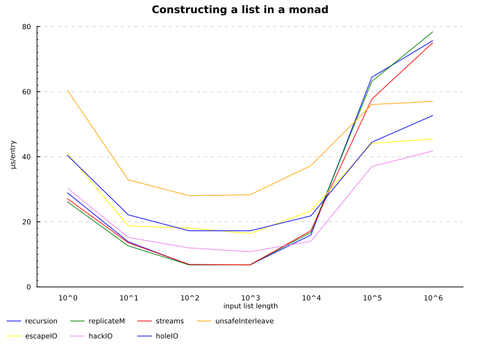

Constructing a list with a monad
================================

This contains the code, benchmarks and analysis that belongs to the blog post <http://www.joachim-breitner.de/blog/684-constructing-a-list-in-a-monad-revisited> which incorporates ideas from <http://neilmitchell.blogspot.co.uk/2015/09/making-sequencemapm-for-io-take-o1-stack.html> and <http://twanvl.nl/blog/haskell/unsafe-sequence>.

Graphs
======

The graph omits some of the less efficient variants, so that details are better visible.

Benchmark results
=================

The table omits those variants with quadratic run time, as I do not want to run them on lists longer than 1000.

| Variant          |  10^0|   10^1|    10^2|    10^3|    10^4|    10^5|   10^6|
|:-----------------|-----:|------:|-------:|-------:|-------:|-------:|------:|
| accumReverse     |  37ns|  153ns|  1134ns|    12µs|   208µs|  8540µs|   97ms|
| recursion        |  29ns|  139ns|   680ns|  6790ns|   160µs|  6441µs|   76ms|
| replicateM       |  26ns|  126ns|   677ns|  6785ns|   168µs|  6314µs|   78ms|
| accumDList       |  35ns|  165ns|   995ns|    10µs|   190µs|  9706µs|  100ms|
| streams          |  27ns|  136ns|   691ns|  6788ns|   173µs|  5771µs|   75ms|
| unsafeInterleave |  60ns|  329ns|  2804ns|    28µs|   373µs|  5605µs|   57ms|
| listFix          |  51ns|  412ns|  4109ns|    56µs|  2761µs|    42ms|  445ms|
| escapeIO         |  41ns|  187ns|  1808ns|    16µs|   234µs|  4409µs|   45ms|
| hackIO           |  30ns|  152ns|  1199ns|    11µs|   140µs|  3701µs|   42ms|
| holeIO           |  40ns|  222ns|  1725ns|    17µs|   218µs|  4446µs|   53ms|

